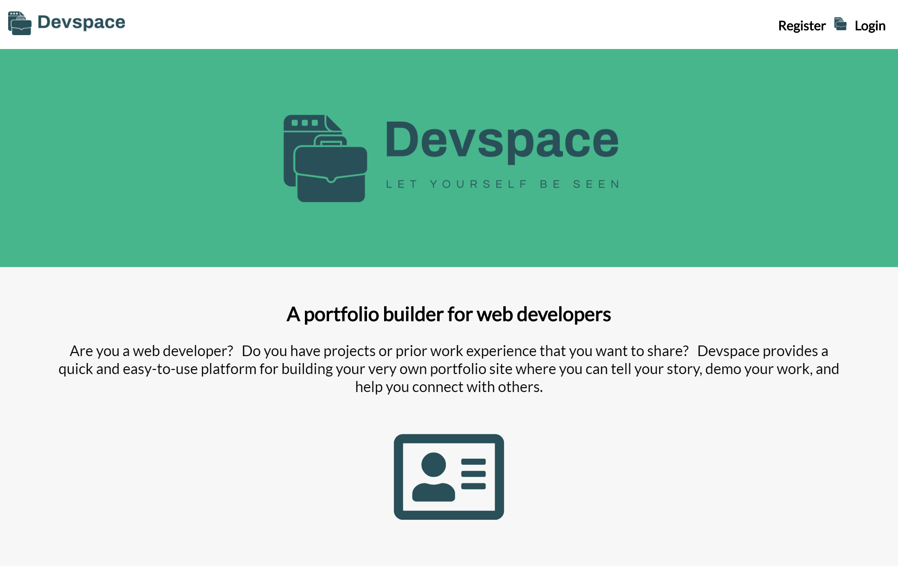
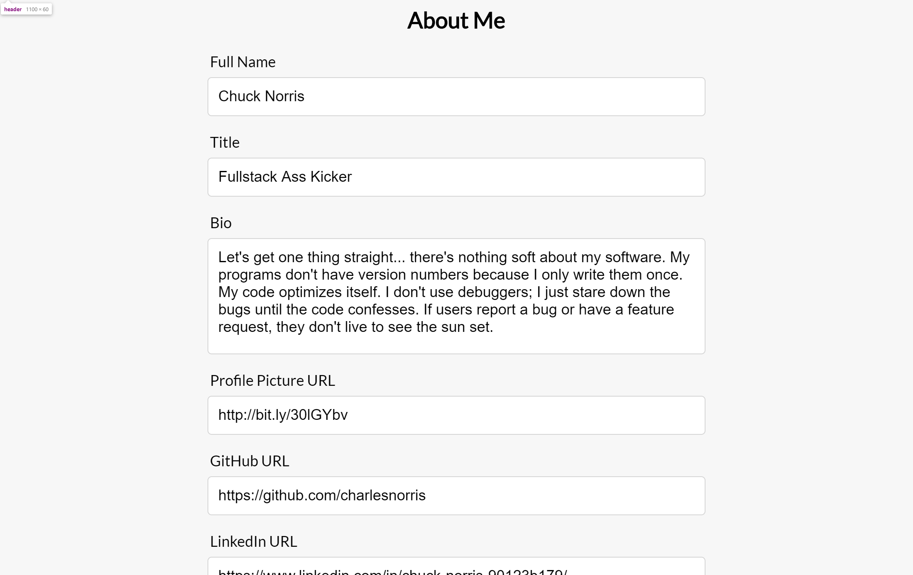
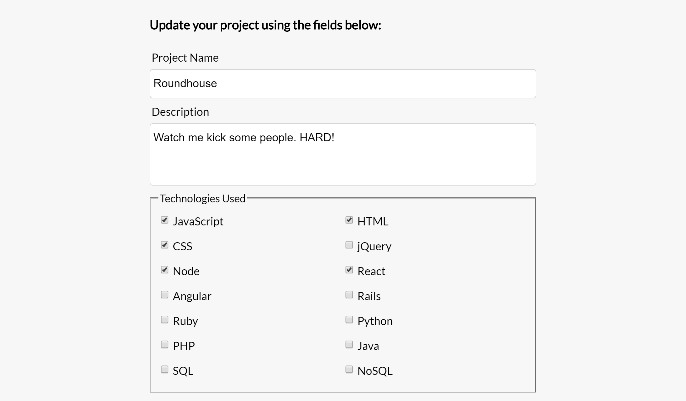
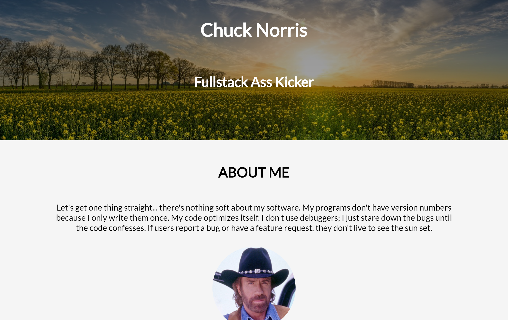

# Devspace

## Description:

A full stack web app that allows web developers to easily create a basic portfolio site to introduce themselves and demo their skills and projects.

## User Access:

Registered users can build their own personal portfolio site. If a user chooses not to register, he or she can use the available guest account to play around in the app (see credentials below):

### Demo Account:
Username: chucknorris  
Password: Portfolio123#

## Demo:

- [Devspace Live App](https://ryanjeske-devspace.herokuapp.com/)

## Screenshots

### Home Page:

### Dashboard:

### Add / Edit Project Form: 

### Portfolio:

## Built With

### Client-Side:
* React
* CSS3

### Server-Side:
- [Devspace API](https://github.com/ryanjeske14/devspace-api)

